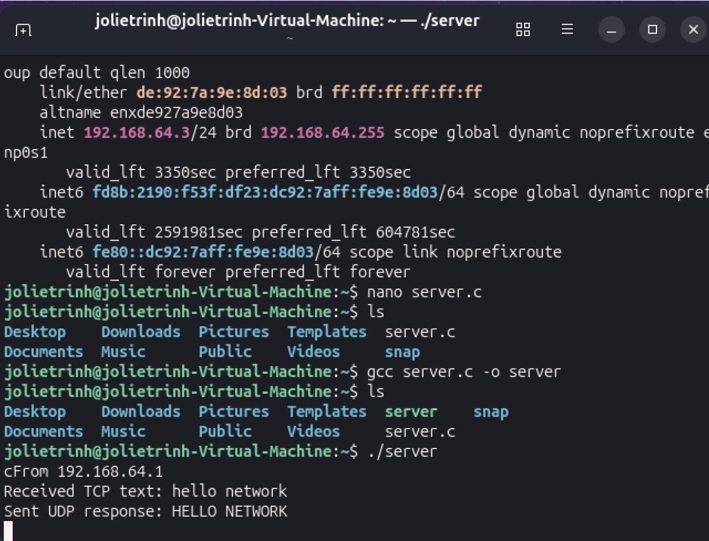
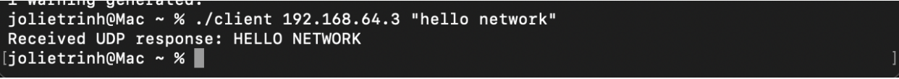

# TCP/UDP Client-Server Application
Cross-platform C socket programming lab simulating TCP client request and UDP server response between Ubuntu Linux (VirtualBox) and macOS


## Overview

A C-based client-server networking application implemented using both TCP and UDP.

The application runs across two different operating systems:

- Server: Ubuntu Linux running in VirtualBox
- Client: macOS host machine

The client sends a text string to the server using TCP. The server converts the received text to uppercase and sends the result back to the client using UDP.

## Test Results

### Ubuntu Server



### macOS Client



## Network Architecture

```text
macOS Client
     |
     | TCP :3500
     ↓
Ubuntu Server
     |
     | UDP :4950
     ↓
macOS Client

